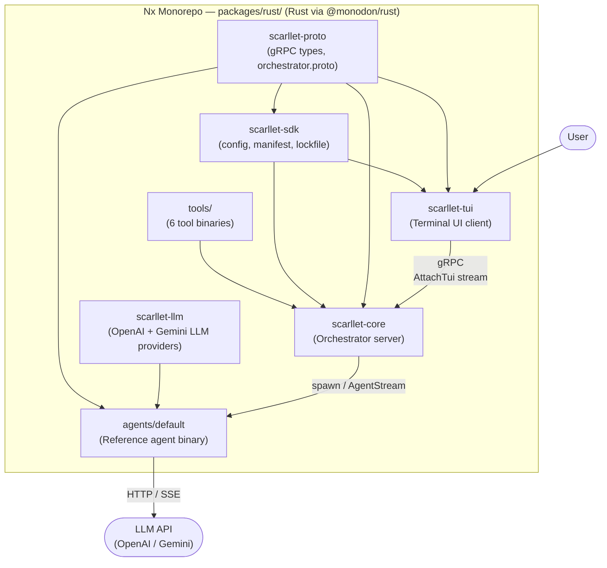

# Scarllet

A personal **Coding Agent AI Harness** for experimenting with harnesses, tooling, and customized agents.

> **Not for production use.** This is an experimental prototyping playground. APIs, structure, and conventions may change without notice.

Scarllet is built to enable fast iteration on ideas around AI agent orchestration, tool integration, and terminal-based interfaces — without the overhead of production-grade concerns. If you want to try a new agent loop, swap an LLM provider, or wire up a custom tool, this architecture gets out of your way.

## Architecture

The system is composed of **nine Rust crates** inside an **Nx monorepo** (`packages/rust/`), connected via **gRPC** (`scarllet-proto`):



| Crate            | Path                           | Role                                                                                                                                                                                              |
| ---------------- | ------------------------------ | ------------------------------------------------------------------------------------------------------------------------------------------------------------------------------------------------- |
| `scarllet-proto` | `packages/rust/scarllet-proto` | Protobuf definitions and `tonic` codegen for the `Orchestrator` gRPC service                                                                                                                      |
| `scarllet-sdk`   | `packages/rust/scarllet-sdk`   | Shared types: config loading (`config.json`), module manifests, lockfile for core address discovery                                                                                               |
| `scarllet-core`  | `packages/rust/scarllet-core`  | Orchestrator binary — gRPC server, module/agent registries, task manager, filesystem watcher for hot-reloading plugins                                                                            |
| `scarllet-tui`   | `packages/rust/scarllet-tui`   | Terminal UI built with **ratatui + crossterm** — chat interface that streams agent responses with markdown rendering, shows git branch info in the status bar                                     |
| `scarllet-llm`   | `packages/rust/scarllet-llm`   | Standalone LLM client library exposing the `LlmProvider` async trait; ships with `OpenAiProvider` (OpenAI-compatible HTTP + SSE streaming) and `GeminiProvider` (Google Gemini via `gemini-rust`) |
| `agents/default` | `packages/rust/agents/default` | Reference agent — connects to core via `AgentStream`, fetches provider config, streams LLM responses back                                                                                         |
| `tools/*`        | `packages/rust/tools/*`        | Six plugin tools: `edit`, `find`, `grep`, `terminal`, `tree`, `write` — each is a standalone binary invoked by core via stdin/stdout JSON                                                         |

### gRPC Service (`Orchestrator`)

The `Orchestrator` service in `orchestrator.proto` defines these RPCs:

| RPC                 | Direction            | Purpose                                                    |
| ------------------- | -------------------- | ---------------------------------------------------------- |
| `GetToolRegistry`   | unary                | Return all discovered tools                                |
| `GetActiveProvider` | unary                | Return active LLM provider config                          |
| `InvokeTool`        | unary                | Execute a tool by name with JSON input                     |
| `EmitDebugLog`      | unary                | Agents emit structured debug logs                          |
| `AttachTui`         | bidirectional stream | TUI sends prompts / receives `CoreEvent`s                  |
| `AgentStream`       | bidirectional stream | Agent receives `AgentInstruction`s / sends `AgentMessage`s |

Task lifecycle (submit / cancel / progress / status) and slash-commands are
handled in-band over `AttachTui` and `AgentStream`, so no dedicated unary RPCs
are exposed for them.

## Runtime Layout

When you run `npx nx run scarllet:release`, Cargo builds all crates in release mode and the release script (`scripts/release.ps1`) assembles them into a flat `release/` folder:

```
release/
  core.exe            # scarllet-core orchestrator
  tui.exe             # scarllet-tui terminal client
  agents/
    default.exe       # default agent
  tools/
    edit.exe          # file editor (patch-based)
    find.exe          # glob search
    grep.exe          # regex search
    terminal.exe      # shell executor
    tree.exe          # directory tree
    write.exe         # file writer
```

> **Note:** `commands/` directories are watched at runtime for plugin binaries but no command plugins are currently shipped.

### Configuration (`config.json`)

Core loads its configuration from `<OS config dir>/scarllet/config.json` (e.g. `%APPDATA%/scarllet/config.json` on Windows). The file defines LLM providers — each with an API URL, API key, model list, and optional settings like reasoning effort or extra body parameters. One provider is marked as `active_provider`.

If the file does not exist, core creates it with empty defaults. Core watches `config.json` for changes and hot-reloads it — any edits are picked up immediately and broadcast to all connected TUI sessions as a `ProviderInfo` event.

### Lockfile (`core.lock`)

When core starts, it binds to a random local port and writes a `core.lock` file next to `config.json` (i.e. `<OS config dir>/scarllet/core.lock`). This file contains the process PID, bound address, and start timestamp. The TUI reads `core.lock` to discover which address to connect to. When core shuts down, it removes the lockfile.

### Module Discovery

Core watches three sets of directories for plugin binaries:

1. **Local** — sibling directories next to the `core.exe` binary (i.e. inside `release/`): `commands/`, `tools/`, `agents/`
2. **User** — under `<OS config dir>/scarllet/` (e.g. `%APPDATA%/scarllet/agents/`)

User directories are scanned after local ones, so user-placed modules can override shipped defaults. For each file found (or created/modified at runtime), core runs `<binary> --manifest` and parses the JSON output as a `ModuleManifest` with fields like `name`, `kind` (`command` / `tool` / `agent`), `version`, `description`, and optional `input_schema`, `timeout_ms`, `capabilities`, and `aliases`. If the probe succeeds, the module is registered; if a file is deleted, it is deregistered.

## Key Architectural Patterns

- **gRPC boundary** — All inter-process communication goes through `orchestrator.proto`. Core, TUI, and agents are separate binaries that speak a single well-defined protocol.
- **Plugin model** — Tools, commands, and agents are standalone executables discovered via `--manifest` JSON output. Core watches filesystem directories and hot-reloads new modules as they appear.
- **Process isolation** — Agents and tools run as child processes. Core communicates with tools via stdin/stdout JSON and with agents via bidirectional gRPC streams (`AgentStream`).
- **LLM abstraction** — The `LlmProvider` async trait in `scarllet-llm` decouples agent logic from any specific provider. Currently ships with `OpenAiProvider` (OpenAI-compatible HTTP + SSE) and `GeminiProvider` (Google Gemini), both selectable at runtime via `config.json`.
- **Broadcast to UIs** — Core multiplexes events (agent started, thinking, streaming response, errors) to all attached TUI sessions via `AttachTui`, so multiple terminals can observe the same agent run.
- **Event sourcing in core** — `scarllet-core` maintains an in-memory event log (`sessions.rs`) and streams state snapshots to connected TUIs for replay/resume.

## How Agents Work

1. Core watches `agents/` directories, probes each binary with `--manifest`, and registers it in the `AgentRegistry`.
2. The user types a prompt in the TUI. The TUI sends it over the `AttachTui` gRPC bidirectional stream to core.
3. Core selects an agent, creates a task, and broadcasts `AgentStarted` to all attached TUIs.
4. Core delivers an `AgentTask` to the agent — either over an already-open `AgentStream` or by spawning the agent binary and waiting for it to connect.
5. The agent calls `GetActiveProvider` to fetch LLM credentials and model settings, then uses `scarllet-llm` to stream the model response. It sends `Progress`, `Result`, or `Failure` messages back on the stream.
6. Core maps those messages to `CoreEvent`s and streams them to every attached TUI for display.

## Fast Prototyping

The architecture is designed to minimize friction when experimenting:

- **New agent** — Write a Rust binary that prints a `--manifest` JSON and connects to the core `AgentStream`. Drop it in the `agents/` directory and core picks it up automatically.
- **New tool** — Even simpler: a binary that reads JSON from stdin and writes JSON to stdout. Place it in the `tools/` directory.
- **Hot-reload** — The filesystem watcher detects new or changed binaries and re-probes manifests without restarting core.
- **Independent evolution** — TUI connects to core over gRPC, so UI changes never require touching orchestration logic (and vice versa).
- **New LLM provider** — Implement the `LlmProvider` async trait in `scarllet-llm` and add a provider variant; swap providers by editing `config.json`.

## Tech Stack

| Layer               | Technology                                                                                                           |
| ------------------- | -------------------------------------------------------------------------------------------------------------------- |
| Language            | **Rust** (edition 2021) inside an **Nx** monorepo managed by [`@monodon/rust`](https://github.com/cammisuli/monodon) |
| RPC                 | **tonic / prost** — gRPC server and client codegen                                                                   |
| Async runtime       | **tokio** (full feature set)                                                                                         |
| Terminal UI         | **ratatui + crossterm** — markdown rendering, scrollable chat history, status bar with git info                      |
| HTTP client         | **reqwest** — for LLM API calls with SSE streaming                                                                   |
| Filesystem watching | **notify** — cross-platform plugin discovery                                                                         |
| LLM providers       | `gemini-rust` for Gemini; `reqwest` for OpenAI-compatible APIs                                                       |

## Getting Started

```sh
npm install
npx nx run scarllet:release
```

This builds all crates and assembles the `release/` folder. Then:

1. Edit `<OS config dir>/scarllet/config.json` to set up at least one LLM provider (API URL, key, model, and mark it as `active_provider`). Supported providers: **OpenAI-compatible** and **Google Gemini**.
2. Run `release/core.exe` — it starts the orchestrator, writes `core.lock`, and begins watching for modules.
3. Run `release/tui.exe` — it reads `core.lock`, connects to core, and opens the chat interface.

## Disclaimer

This project is a **personal experiment**. It is not intended for production use. There are no stability guarantees — APIs, data formats, and project structure may change at any time.
